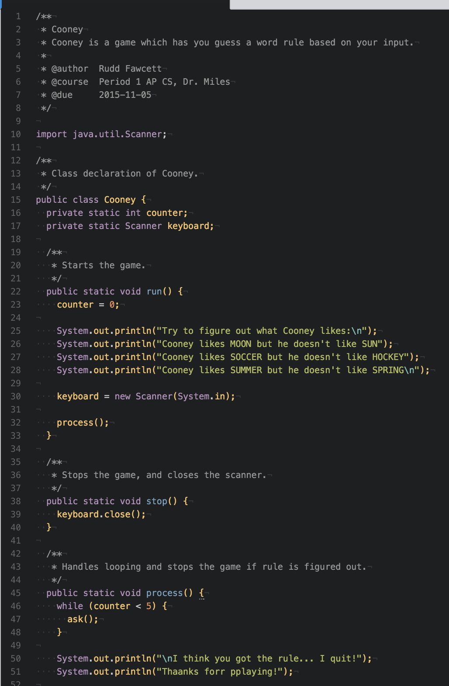

## Cooney
Cooney - a game which has you guess a word rule based on your input.

 - **Authors:** Rudd Fawcett
 - **Program:** `Cooney.java`
 - **Due:** 11/05/2015

### `java Cooney`

### `Cooney.java`

