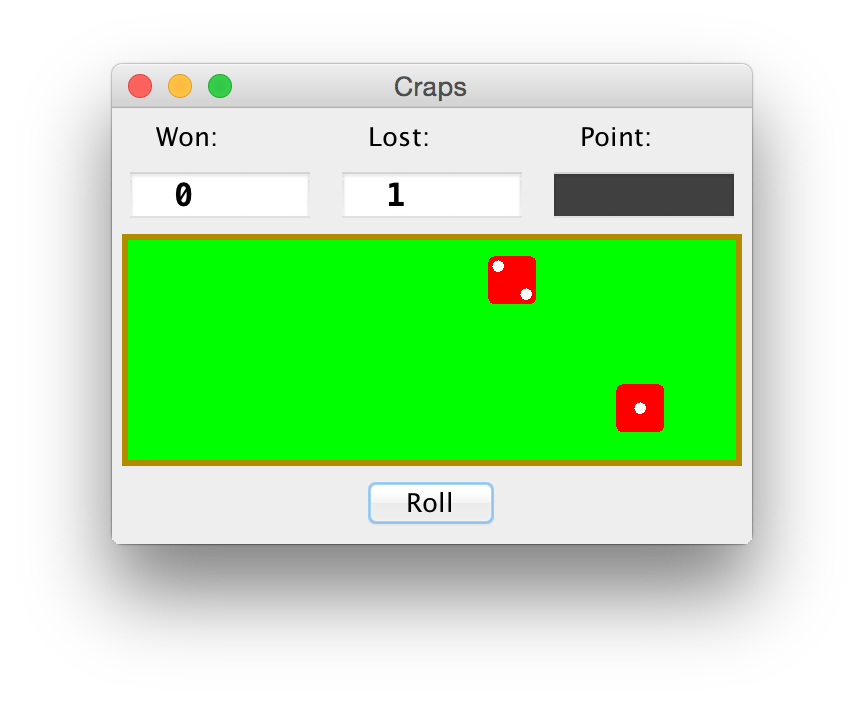

## Craps
Allows you to play a game of craps via a GUI.

- **Author:** Rudd Fawcett
- **Course:** Period 1 AP CS, Dr. Miles
- **Files:**
  - `CrapsGame.java`
  - `Die.java`
  - `DieTest.java`
  - `RollingDie.java`
- **Due:** 10/20/2015
 
 
 
 
 
 
 
 
 
 
 
 
 
 
 
 
 
 
 
 
 
 
 
 
 
 
### `CrapsGame.java`
The source code **added** for `CrapsGame.java`.

 
 
 
 
 
 

### `RollingDie.java`
The source code **added** for `RollingDie.java`

 
 
 
 
 
 
 
 

### `java CrapsTest1`
The result of running `java CrapsTest1` and testing various rolls to test the game functionality.

 
 
 
 
 
 
 
 

### `DieTest.java`
The source code for `DieTest.java`.

 
 
 
 
 
 
 
 
 
 
 
 
 
 
 
 
 
 
 
 
 
 
 

### `java DieTest`
An example of running `DieTest.java` -- you can choose how many rolls to test for.

 
 
 
 
 
 
 
 
 
 
 
 
 
 
 
 
 
 

### `java Craps`
The result of playing the Craps game.

I lost the first roll here because I rolled a 3.

I didn't lose or win here because I rolled a 6.

I won here because I rolled the correct number of points on a subsequent roll.
