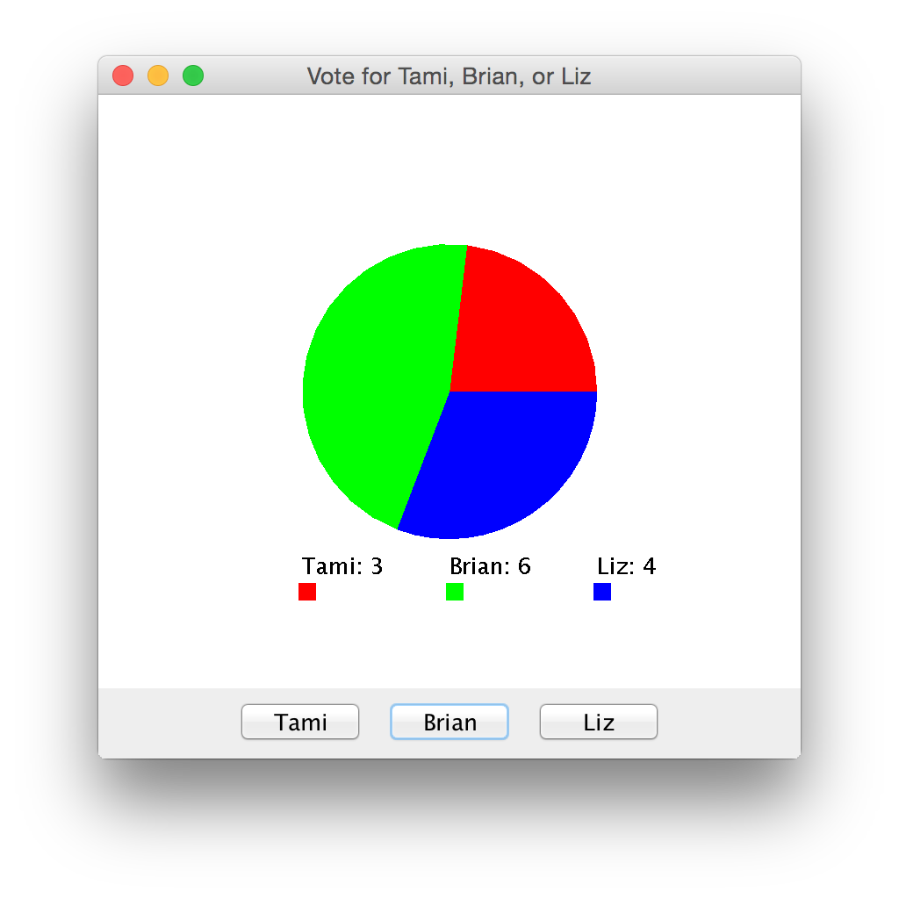

## PollTest
Lab 5.11 — Fixed the `PollDisplayPanel.java` class, and implemented our own custom `main` method in `PollTest.java`.

 - **Authors:** Rudd Fawcett & Alex Emerson
 - **Program:** `PollTest.java` and `PollDisplayPanel.java`
 - **Due:** 10/02/2015

This screenshot shows the output of the custom `main` method on `PollTest.java`.  You can vote for a person via the CLI.

This screenshot shows the result of running `Poll.java` with the fixed methods, and voting randomly for a few people.
