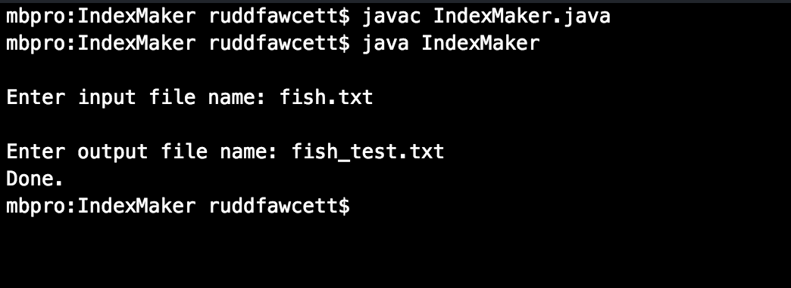
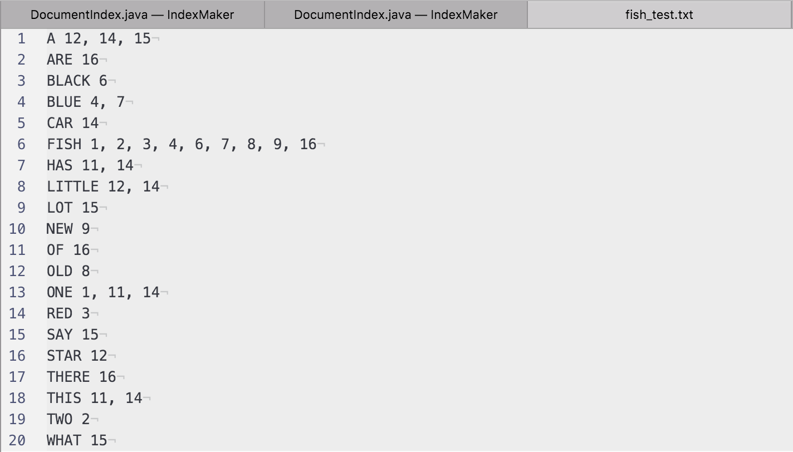

## IndexMaker
Organizes every word in a text file alphabetically, and adds each word's line number.

- **Author:** Rudd Fawcett & Rohan Lewis
- **Course:** Period 6 AP CS, Ms. Litvin
- **Files:**
  - `IndexEntry.java`
  - `DocumentIndex.java`
- **Due:** 02/01/2016

### `java IndexMaker`

