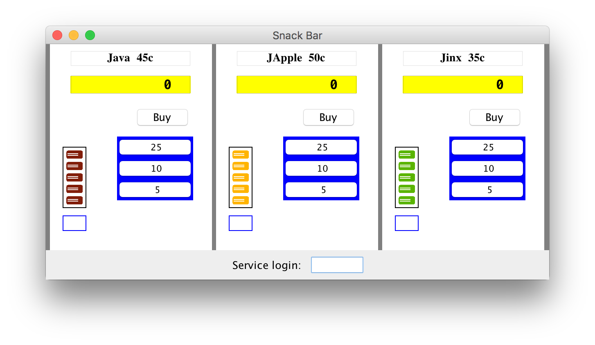
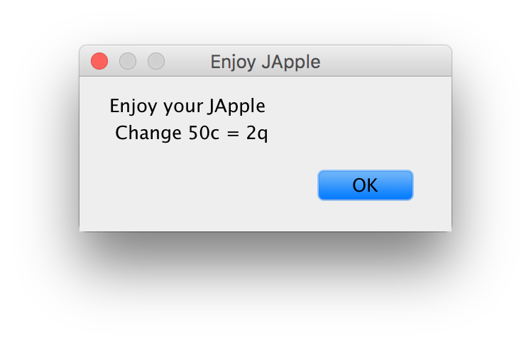
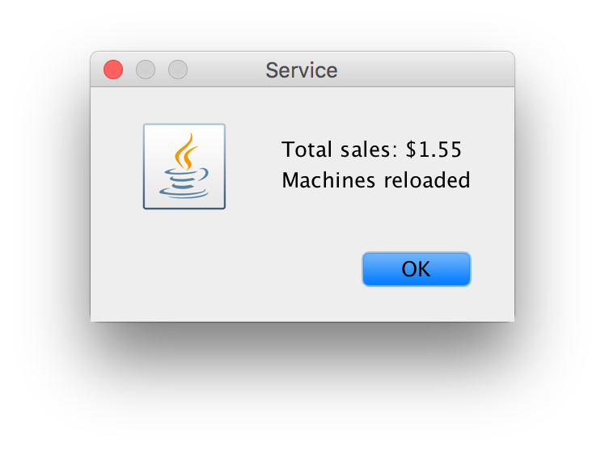

## SnackBar2
Lets a user purchase items at a vending machine, and lets the manager see the total sales.

- **Author:** Rudd Fawcett
- **Course:** Period 6 AP CS, Ms. Litvin
- **Files:**
  - `Coins.java`  
  - `TestCoins.java`
  - `Vendor.java`
  - `VendingMachine.java`
- **Due:** 1/15/2016

### `java Snackbar`

